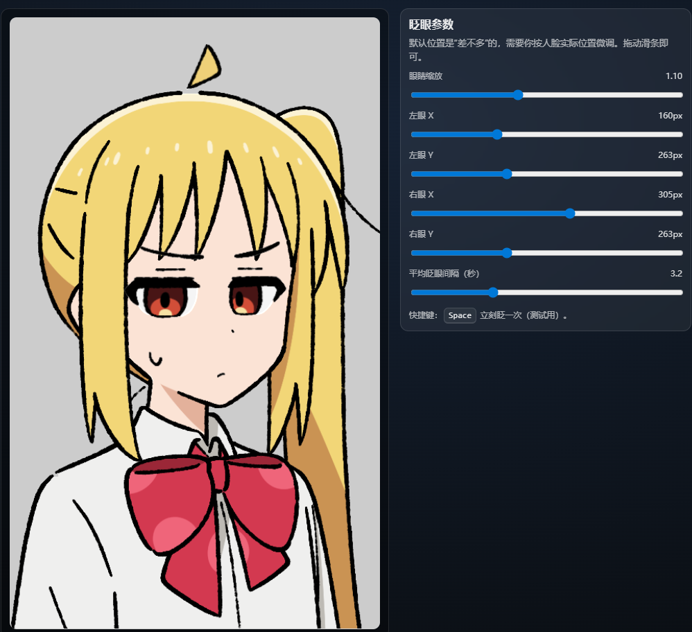
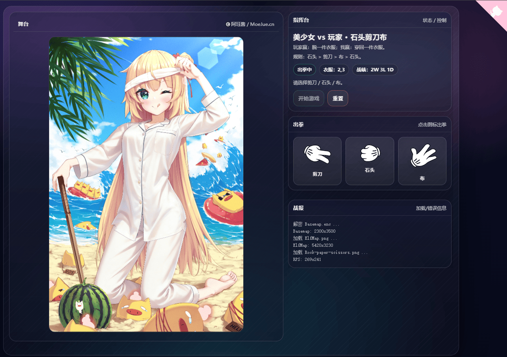

# 精灵图三个版本应用：眨眼 + 呆毛甩动效果对比

本仓库实现了同一套效果的 3 个版本：
- 眨眼（从上往下合眼）(目前只使用了一个版本的素材)
- 眉毛/下眼皮联动
- 流汗轻微飘动
- 呆毛围绕左下角支点甩动

### 复刻

- 学习 Canvas 2D / WebGL / js
- 素材来源（灵感/参考）：https://tamanidamani.itch.io/nijikas-ahoge

## 目录结构
- `canvas/`：Canvas WebGL 版本
- `canvas2D/`：Canvas 2D 版本
- `dom/`：纯 HTML + JS（操作 DOM）版本（不使用画布）

## 运行方式
建议起一个静态服务（直接双击打开 HTML 可能会有跨域/路径问题）：

```bash
python -m http.server 8000 --directory .
```

然后打开：
- WebGL：`http://localhost:8000/canvas/`
- Canvas 2D：`http://localhost:8000/canvas2D/`
- DOM：`http://localhost:8000/dom/`

## 三个版本差异（优缺点）

### 1) WebGL（`canvas/`）
**实现方式**
- 用 WebGL2 绘制底图 + 精灵图贴片叠加，动画由 JS 驱动 shader 的 uniform/绘制参数。

**优点**
- 性能上限高：适合元素很多/分辨率高/需要更复杂特效（滤镜、shader）的场景。
- 所有像素合成在 GPU 上做，叠加层数多时更稳。

**缺点**
- 代码复杂度更高（shader、uniform、坐标系、纹理上传等）。
- 调试门槛更高；WebGL2 在极少数环境可能不可用或被禁用。

### 2) Canvas 2D（`canvas2D/`）
**实现方式**
- 用 `CanvasRenderingContext2D.drawImage()` 叠加绘制。
- 眨眼用“从上往下裁剪源图 + 底边固定”的方式模拟合眼。
- 呆毛用 `save/translate/rotate/drawImage/restore` 围绕支点旋转。

**优点**
- 逻辑直观、好调试、兼容性好（几乎所有浏览器都支持）。
- 不需要 shader，适合中等复杂度的 2D 动画。

**缺点**
- 元素非常多、分辨率很高时，CPU 侧绘制可能成为瓶颈。
- 复杂特效（像素级滤镜、混合）可做但性能/实现不如 WebGL 灵活。

### 3) DOM（`dom/`）
**实现方式**
- 底图用 ``，五官用绝对定位的 `<div>`（通过 `background-position/background-size` 取 atlas 子矩形）。
- 合眼用“mask（overflow:hidden）+ 内层 sprite 贴底”的方式。
- 呆毛用 `` + `transform-origin` + `rotate()` 甩动。

**优点**
- 最容易嵌到常规网页 UI 里（可直接用 CSS/布局系统/事件系统）。
- 可与文本/按钮/布局组件无缝混排。

**缺点**
- 复杂叠加/大量元素时，DOM/CSS 计算与合成开销可能更大。
- 像素级控制不如 canvas 精准，跨浏览器的渲染细节差异更容易出现。


## 效果图


---

# 🔞 Undressing（石头剪刀布）

`undressing/` 目录新增一个二次元风格的 WebGL 石头剪刀布小游戏：电脑 vs 玩家。

## 玩法
- 玩家赢：按“脱去顺序”脱掉一件衣服；当有 `reveals` 规则时，下一件衣服会立刻盖上（切换过程中尽量不露底图）。
- 电脑赢：按玩家已脱衣服的逆序穿回一件衣服（没有就不穿）。
- 规则：石头 > 剪刀 > 布 > 石头。

## 资源
- 人物底图（加密）：`undressing/Basemap.enc`
- 衣服精灵图：`undressing/ElfMap.png`
- 石头剪刀布精灵图：`undressing/Rock-paper-scissors.png`

## 调试/配置衣服位置
页面内预留了调试脚本：`undressing/devtools.js`。

- 在 `undressing/index.html` 取消注释 `devtools.js` 的 `<script>` 即可启用调试面板
- 支持：自由勾选显示哪些衣服、拖拽移动、输入框微调 `x/y/w/h/z`、复制当前配置 JSON

